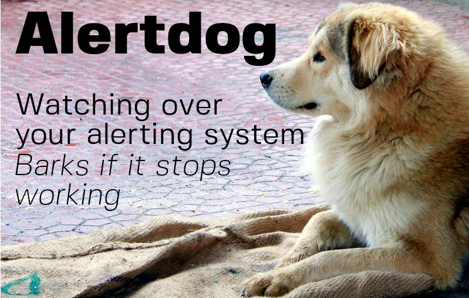

[Guard dog](https://www.flickr.com/photos/_pavan_/5519497579) by [`_paVan_`](https://www.flickr.com/photos/_pavan_/) is licensed under [CC BY 2.0](https://creativecommons.org/licenses/by/2.0/)

Alertdog is software system to detect failures in a prometheus + alertmanager
alerting system.

If there is problem that means that prometheus, or alertmanager are not working
as expected Alertdog will raise the alert, either via alertmanager, or if that
is not possible via PagerDuty.

## Design

You can read detailed information about the design of Alertdog [here](docs/design.md)

## Getting started

To get started with Alertdog check out the [getting started documentation](docs/getting_started.md)
